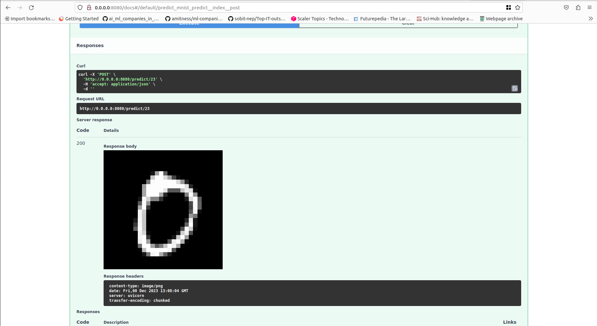
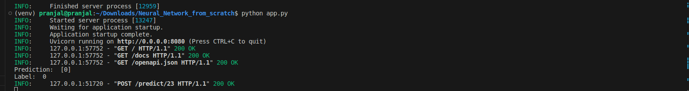

# Neural Network Implementation from scratch

This project involves the creation and implementation of a neural network from scratch to classify handwritten digits using the MNIST dataset. The MNIST dataset consists of 28x28 pixel grayscale images of handwritten digits (0-9), making it a standard benchmark for image classification tasks. The neural network architecture is implemented without using any external deep learning libraries. The architecture includes an input layer, two hidden layers with 300 and 100 neurons with ReLU activation functions, and an output layer with softmax activation for multiclass classification.

All the steps including paramater initialization, forward propagation, back propagation, One hot encoding of labels, cost function and activation function are completely implemented with only Numpy.

# Technologies Used

1. Python
2. Numpy
3. Pandas
4. FastAPI

# Installation

1. git clone https://github.com/pranzalkhadka/Neural_Network_from_scratch.git
2. cd Neural_Network_from_scratch
3. Create and activate a virtual environment (optional)
4. pip install -r requirements.txt
5. python train.py
6. python app.py

# Result

